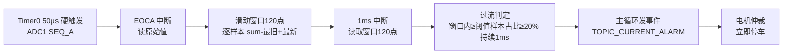

# 新过流方案（窗口占比判据）

> 日期：2026-08-07　分支：`restore-b948c7e`　状态：**已提交，实测效果良好**

## 一、方案原理

- 工况：**直流有刷电机关窗器**，通过**堵转电流**判断窗户是否关紧；电流存在 **2ms 周期性抖动**，且堵转平均电流越大、抖动幅值越大。
- 目标：**电机在真实平均电流接近设定阈值时停住**（阈值 1.1A 就应在平均约 1.1A 时停车）。

实现手段：

1. **50µs（20kHz）采样**（`ADC_SAMPLE_INTERVAL_US = 50U`）；
2. **120 点滑动窗口 = 6ms = 3 个完整纹波周期**：在 EOCA 中断里逐样本维护 `sum = sum - 最旧 + 最新`，整数倍周期平均可**精确抵消 2ms 纹波**，与纹波幅值无关；
3. **窗口占比判据（泛化的平均值判据）**：平均值 ≈ 窗口样本的 50% 线；现改为可配置百分比——**窗口内 ≥ 阈值的样本占比 ≥ 20%（`OVERCURRENT_WINDOW_PERCENT = 20U`）即判定该点过流**（50≈原均值判据）；
4. 占比达标并**持续 1ms**（`current_detect_ms = 1U`）→ 判定堵转 → 事件 → 仲裁 → **立即停车**；
5. ADC 采样与滤波**只由 1ms 中断消费**，主循环不消费 ADC；零位校准读取同一均值路径（EOCA 采集保持开启）。

## 二、关键参数

| 参数 | 宏 / 寄存器 | 值 |
|---|---|---|
| ADC 采样周期 | `ADC_SAMPLE_INTERVAL_US` | 50µs（20kHz） |
| 滑动平均窗口 | `ADC_MEAN_WINDOW_SAMPLES` | 120 点（6ms=3 个纹波周期） |
| 窗口占比判据 | `OVERCURRENT_WINDOW_PERCENT` | 20% |
| 过流阈值 | `current_upper_limit`（`0x2716`） | 1100mA |
| 判定持续时间 | `current_detect_ms`（`0x271E`） | 1ms |
| 过流滞回 | `current_hysteresis_ma` | 0 |
| 过流模式 / 清除 | `OVERCURRENT_MODE` / `OVERCURRENT_CLEAR_MODE` | 时间窗口 / 手动 |

## 三、数据流

## 四、实测结果

- 采用窗口占比 20% 判据后**效果良好**：堵转停车点稳定、接近设定平均电流，不受 2ms 电流纹波幅值变化影响。

## 五、相关文件

- `Adp/Adc.h`：采样间隔 50µs
- `Dev/dev_adc.h` / `Dev/dev_adc.c`：120 点滑动平均
- `Dev/dev_sensor.h` / `Dev/dev_sensor.c`：窗口占比 20% 判据
- `App/App_Motor_Project.c`：主循环 ADC 消费禁用
- `Utils/App_Params.h`：`current_detect_ms = 1`
